# Trabajo 2º Trimestre - Despliegue (Frontend + Backend + MongoDB Atlas)

Este README deja organizadas las evidencias pedidas en 3 bloques:

- Frontend (React + Vercel)
- Backend (Node/Express + Render)
- MongoDB Atlas + Mongoose

## Estado de evidencias (segun imagenes en `img/`)

1. Captura 1 - Estructura del proyecto frontend: `OK` (`img/1.Estructura-frontend.png`)
2. Captura 2 - Componente principal `App.jsx`: `OK` (`img/1.2.App-frontend.png`)
3. Captura 3 - Peticion a la API desde frontend: `OK` (`img/1.3.api-frontend.png`)
4. Captura 4 - Frontend funcionando en local: `OK` (`img/2.Visual-frontend.png`)
5. Captura 5 - Proyecto en Vercel (dashboard): `OK` (`img/3.Dashboard-frontend.png`)
6. Captura 6 - Deploy finalizado en Vercel: `OK` (`img/4.Deploy-frontend.png`)
7. Captura 7 - Frontend desplegado online: `OK` (`img/2.Visual-frontend.png`)
8. Captura 8 - Estructura del backend: `OK` (`img/5.Estructura-backend.png`)
10. Captura 10 - Rutas REST: `OK` (`img/6.Rutas-backend.png`, `img/6.2.rutas-backend.png`)
11. Captura 11 - Backend funcionando en local: `OK` (`img/7.Comprobacion-backend.png`)
12. Captura 12 - Servicio creado en Render: `OK` (`img/8.Dashboard-backend.png`)
13. Captura 13 - Deploy correcto en Render (logs): `OK` (`img/9.Logs-backend.png`)
14. Captura 14 - API desplegada: `OK` (`img/10.api-backend.png`, `img/10.1.api-backend.png`)
15. Captura 15 - Cluster en MongoDB Atlas: `OK` (`img/11.cluster-atlasdb.png`)
16. Captura 16 - Base de datos y coleccion: `OK` (`img/12.Collections--atlasdb.png`)
17. Captura 17 - Conexion a MongoDB con Mongoose: `OK` (`img/13.connect-atlasdb.png`)
18. Captura 18 - Modelo Mongoose: `OK` (`img/14.modelo-atlasdb.png`)
19. Captura 19 - GET con MongoDB: `OK` (`img/15.getfav-atlasdb.png`)

## BLOQUE 1 - FRONTEND (React + Vercel)

### Captura 1 - Estructura del proyecto frontend
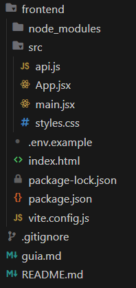

### Captura 2 - Componente principal (App.jsx)
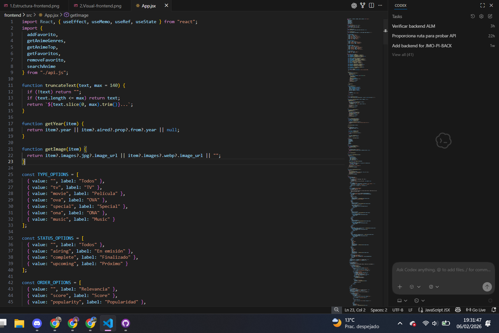

### Captura 3 - Peticion a la API desde el frontend
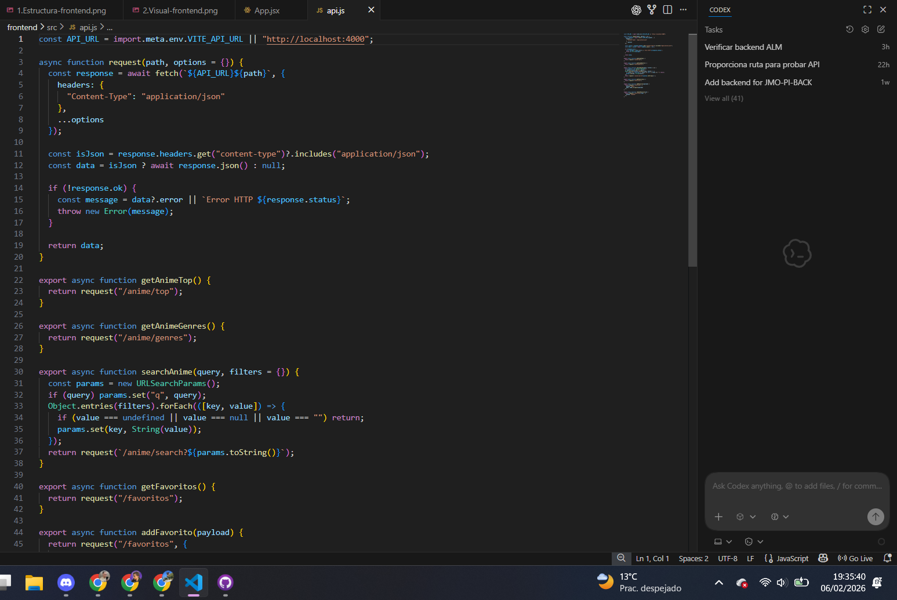

### Captura 4 - Frontend funcionando en local
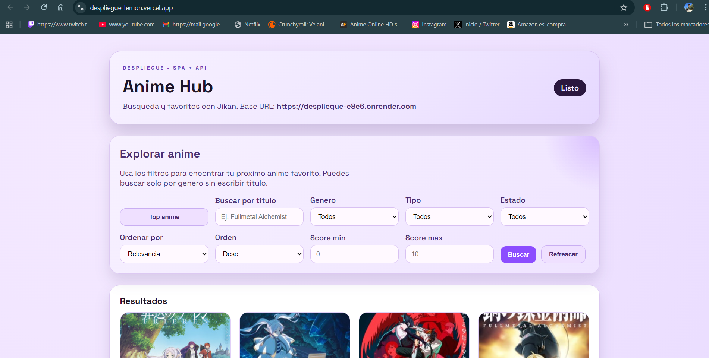

### Captura 5 - Proyecto en Vercel
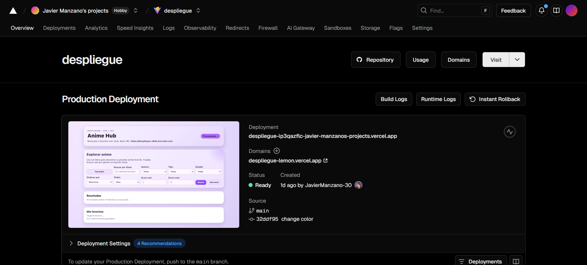

### Captura 6 - Deploy finalizado en Vercel
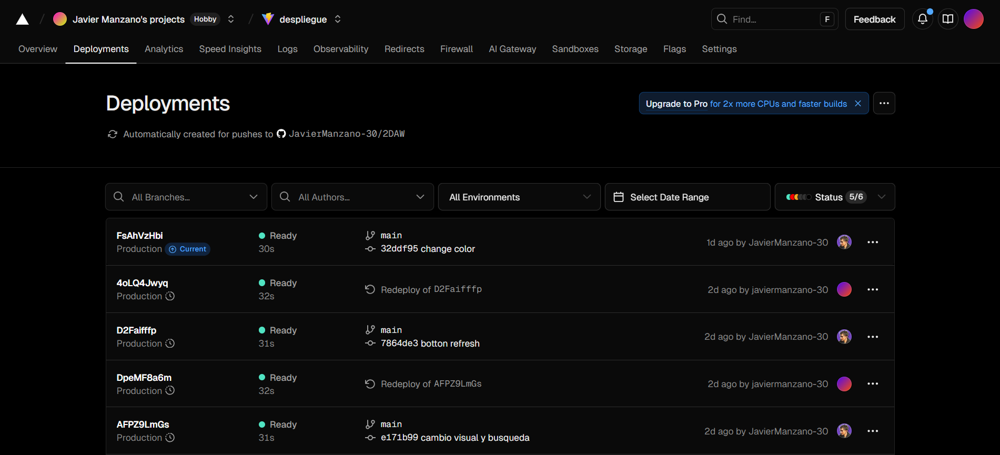

### Captura 7 - Frontend desplegado

## BLOQUE 2 - BACKEND (Node + Render)

### Captura 8 - Estructura del backend
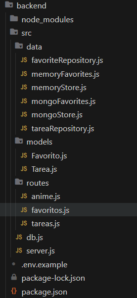

### Captura 10 - Rutas REST
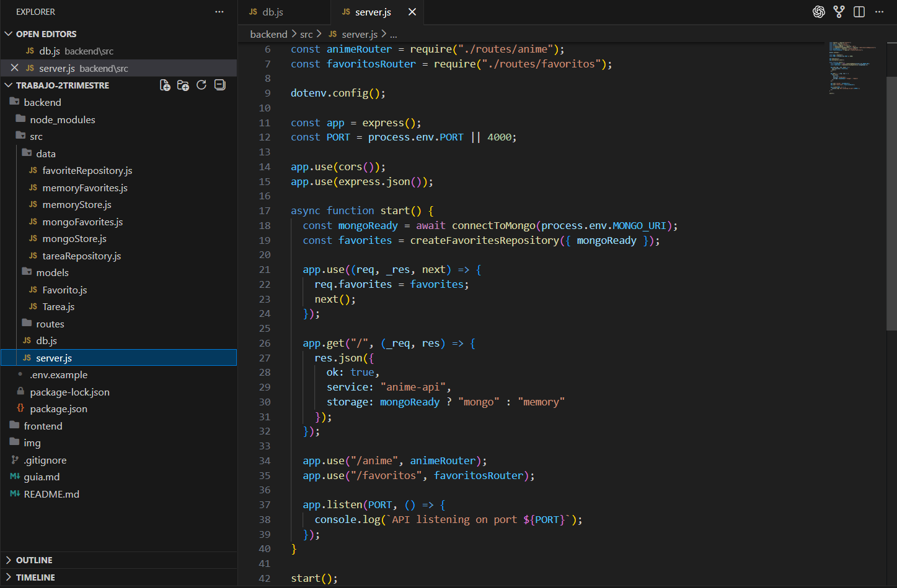
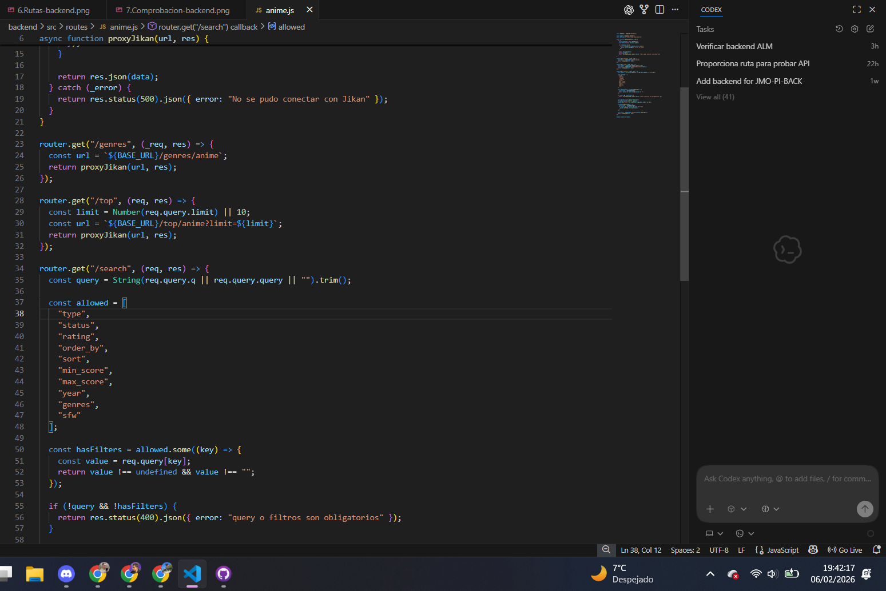

### Captura 11 - Backend funcionando en local
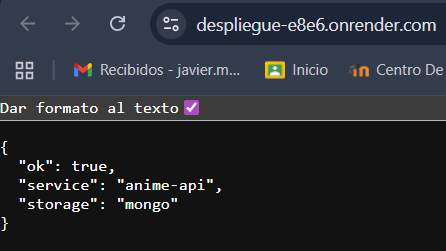

### Captura 12 - Servicio creado en Render
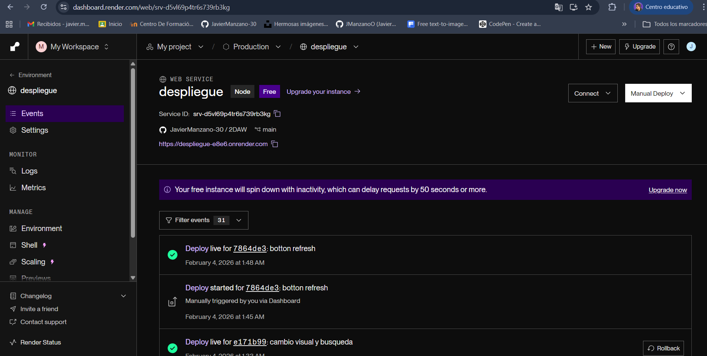

### Captura 13 - Deploy correcto en Render
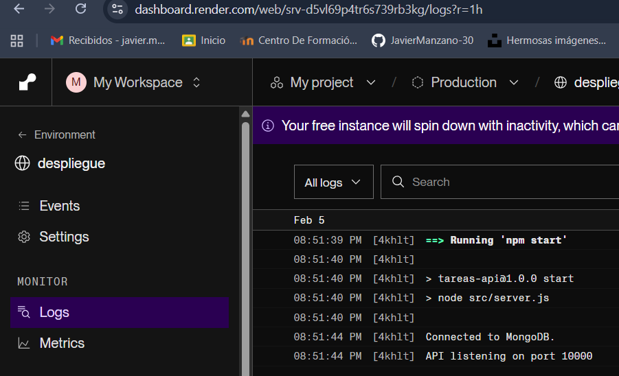

### Captura 14 - API desplegada
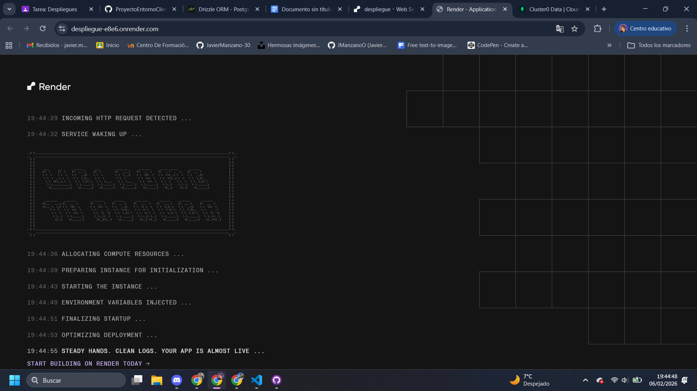
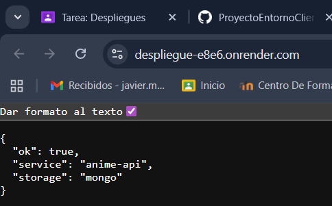

## BLOQUE 3 - MONGODB ATLAS + MONGOOSE

### Captura 15 - Cluster en MongoDB Atlas
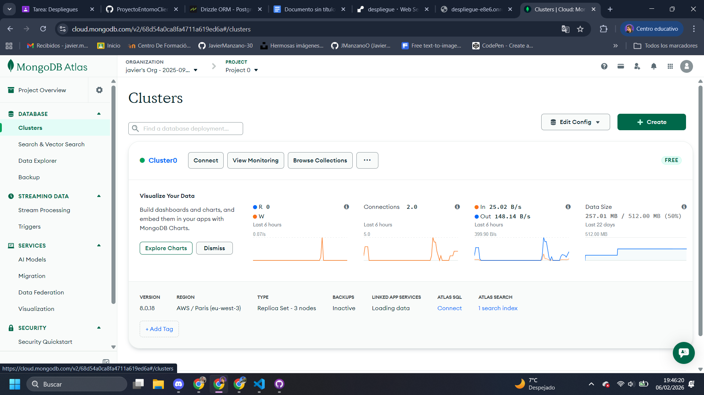

### Captura 16 - Base de datos y coleccion
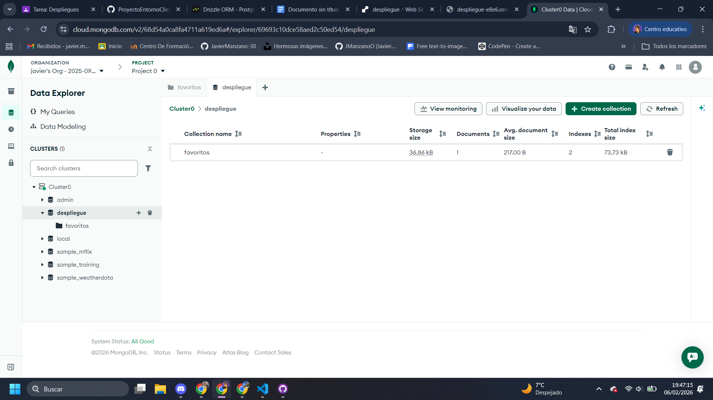

### Captura 17 - Conexion a MongoDB con Mongoose
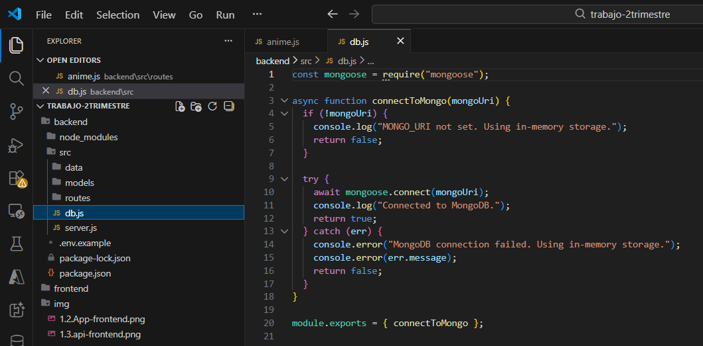

### Captura 18 - Modelo Mongoose
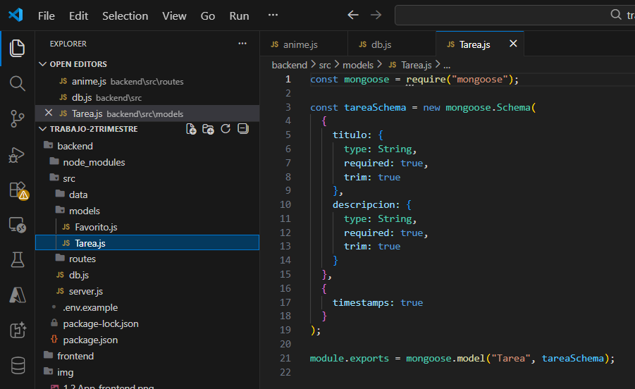

### Captura 19 - GET con MongoDB
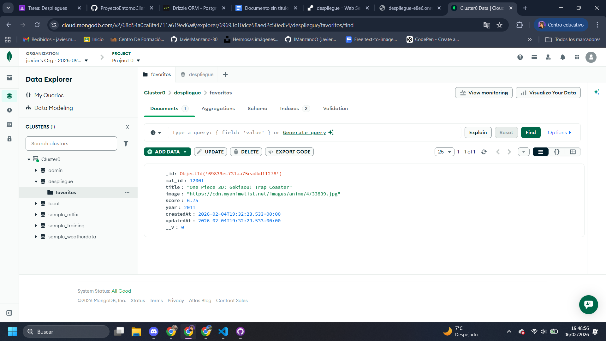
